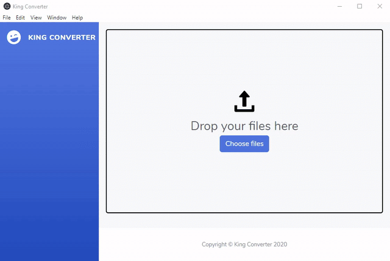

# 👑 King Converter



## Demo Video for FOSS Hack 2020

[Watch on YouTube](https://youtu.be/rSDrg_mqwSE)

## Inspiration

Let's face it. We've always been at a point in life where we needed it to convert one format to another. Maybe an online application only accepted `.jpeg` image format, and you had a `.webp` file.

For us techies, it might not seem like a big deal. Maybe it's just a google search away for the required commandline options for ffmpeg. But when you switch to Windows, disaster strikes again. There's no good universal, open-source, GUI file converter that you can use. And you certainly don't want to upload your precious data to some random converter site.

That's why we decided to make a cross-platform electron app that serves as a beautiful GUI frontend to the ffmpeg and sharp libraries.

## What does King converter do?

King converter aims to be the one stop app that can convert one format to another, whether it be an image, audio or video file. This app tries to keep the conversion process as simple as possible with the clean and simple GUI.

## Download Executable

- [Download for Windows](https://github.com/KingConverter/KingConverter/releases/download/latest/king-converter.1.0.0.exe)

## Build from source

To build from source, you will need Node v12+ and npm.

```zsh
# Install dependencies
npm install

# Run electron build
npm start
```

## Usage

Our usage guide can be found [here](./USAGE.md).

## Dependencies

We have used the following npm packages:

- For image conversion: [sharp](https://www.npmjs.com/package/sharp)
- For audio/video conversion: [ffmpeg-static-electron](https://www.npmjs.com/package/ffmpeg-static-electron)

## Contributors

- [Joshua T.](https://github.com/radiantly)
- [Rohit Sanjay](https://github.com/rohitsanj)
- [Sahaj Kedia](https://github.com/sahajkedia)
- [Sravanth C.](https://github.com/sravanth-chebrolu)

## License

[MIT License](https://github.com/KingConverter/KingConverter/blob/master/LICENSE)
