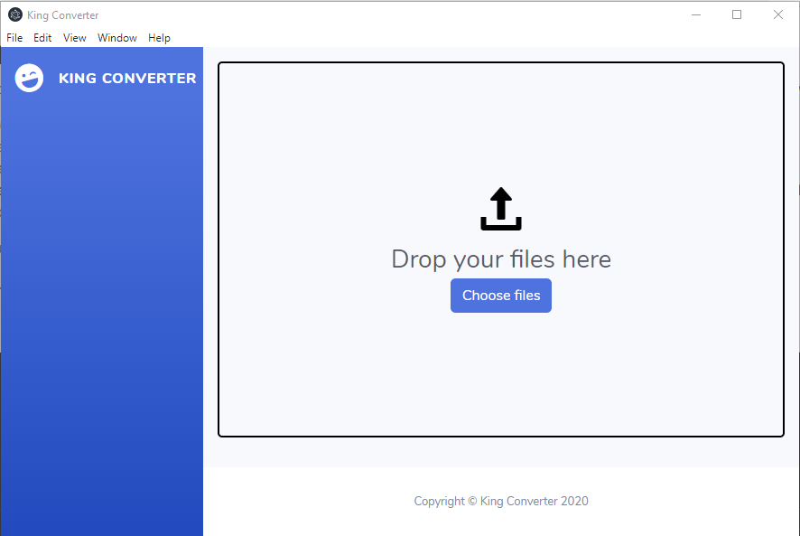

# Usage - King Converter

First off, thank you for using King Converter!

Here is a short usage guide on how to navigate and use the King Converter app.

1. Download and Run the King Converter Application

Download the application from [here](https://github.com/KingConverter/KingConverter/releases/download/latest/king-converter.1.0.0.exe). After the executable finishes downloading, double-click on `king-converter.1.0.0.exe` and wait for the application to load.

2. Move the file(s) you want to convert into the app or click on "Choose files". Please note that all input files must be of the same format. This is an intentional design choice.

3. Choose your desired destination format and also the directory in which you want the converted files to end up.

4. That's it! King Converter will now open up your output directory so that you don't have to go looking for your converted files.

You should now find all your converted files in that directory, if not - please raise an issue [here](https://github.com/KingConverter/KingConverter/issues) and we will try to resolve it.
